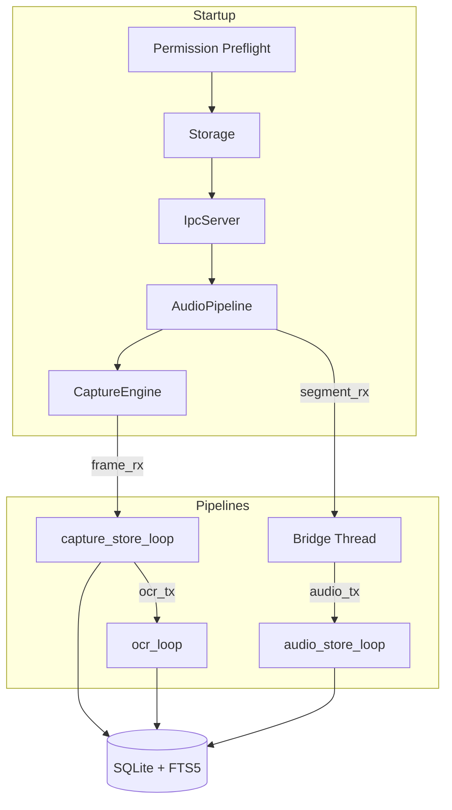

# Developer Guide — Chronicle Daemon

**Last updated:** 2026-04-06
**Component path:** chronicle-daemon/

## Overview

The daemon is Chronicle's background process. It captures screens, records
audio, runs OCR, and stores everything in SQLite with full-text search. It runs
headless via launchd, independent of the UI. The UI communicates with it over a
Unix socket (ADR-004). The current IPC surface is status-only.

The daemon is a Cargo workspace with six crates, each owning one concern. The
root binary (`chronicle-daemon`) orchestrates startup, wires crates into
pipelines, and handles shutdown.

## Architecture



**Key files:**

| File | Role |
|------|------|
| `src/main.rs` | Entry point, startup sequence, shutdown |
| `src/permissions.rs` | macOS TCC permission checks (Screen Recording, Microphone) |
| `src/pipeline.rs` | Async tasks: capture-to-store, OCR, audio-to-store, bridge thread |

### Startup Sequence

1. `env_logger::init()` — logging
2. `permissions::preflight()` — checks Screen Recording (hard gate) and
   Microphone (informational). Exits with an actionable error if Screen
   Recording is denied.
3. `Storage::open()` — opens/migrates SQLite database
4. `IpcServer::start()` — starts the Unix-socket status server
5. `AudioPipeline::create()` — prepares the audio handler, dispatch queue, and
   encoding thread used by ScreenCaptureKit audio callbacks
6. `CaptureEngine::start()` — enumerates displays, starts one SCStream per
   display, registers the audio handler on the primary display, and returns a
   frame receiver channel
7. Spawn `capture_store_loop` (Task A) and `ocr_loop` (Task B)
8. Spawn bridge thread and `audio_store_loop` (Task C)
9. `ctrl_c().await` — blocks until shutdown signal

### Channel Topology

```text
CaptureEngine → [frame_rx: mpsc] → Task A (capture_store_loop)
                                        ↓ encode HEIF, insert DB
                                        ↓ try_send (lossy, best-effort)
                                   [ocr_tx: tokio::mpsc(1024)] → Task B (ocr_loop)
                                                                      ↓ Vision OCR
                                                                      ↓ update DB

AudioPipeline → [segment_rx: std::sync::mpsc] → Bridge Thread
                                                     ↓ blocking_send (lossless)
                                               [audio_tx: tokio::mpsc(64)] → Task C (audio_store_loop)
                                                                                 ↓ move file, insert DB
```

Capture-to-OCR is lossy (`try_send`) because OCR is slow and screenshots are
supplementary. Audio is lossless (`blocking_send`) because dropping a 30-second
segment means data loss.

### Shutdown

Triggered by `ctrl_c`. Cascades through the system:

1. `engine.stop()` + `drop(engine)` — stops SCStreams, closes `frame_rx`
2. `audio_pipeline.stop()` — drops the audio handler and flushes the encoding thread
3. `bridge_handle.join()` — bridge thread drains and exits, closing `audio_tx`
4. `await` all async tasks — they exit when their input channels close

No forced cancellation. Everything drains naturally.

## Key Concepts

**Two-process architecture (ADR-001):** The daemon and UI are separate
processes. If the UI crashes, capture continues. The daemon starts via launchd
at login.

**Async OCR (and future transcription) (ADR-005):** Capture and storage are the
critical path. OCR already runs behind the main ingestion loop, and any future
transcription work should follow the same pattern.

**Permission preflight:** Screen Recording is required for all ScreenCaptureKit
functionality (both screen capture and audio). Microphone is optional — mic
capture is off by default and toggled from the UI.

## How to Modify

### Adding a new pipeline stage

1. Define a channel in `main.rs` (decide bounded size and lossy vs lossless)
2. Write the async loop function in `pipeline.rs` following the existing pattern
3. Spawn it with `tokio::spawn` in `main.rs`
4. Add shutdown handling (tasks exit when their input channel closes)

### Adding a new permission check

1. Add a status enum and FFI call in `permissions.rs`
2. Call it from `preflight()` — decide hard gate vs informational
3. Log the status at the appropriate level (info for ok, error for denied)

### Adding a new crate to the workspace

1. Create the crate under `crates/`
2. Add it to `chronicle-daemon/Cargo.toml` workspace members and dependencies
3. Wire it into `main.rs` and/or `pipeline.rs`

## Dependencies

### Workspace Crates

| Crate | Purpose | Key External Deps |
|-------|---------|-------------------|
| `chronicle-capture` | Screen capture via ScreenCaptureKit | `screencapturekit`, `objc2-app-kit`, `core-graphics` |
| `chronicle-audio` | Audio capture + Opus encoding | `objc2-screen-capture-kit`, `opus`, `ogg` |
| `chronicle-storage` | SQLite + FTS5 storage engine | `rusqlite` (bundled), `r2d2` |
| `chronicle-ocr` | Text extraction via Vision framework | `objc2-vision` |
| `chronicle-transcription` | Placeholder for future speech-to-text work | none today |
| `chronicle-ipc` | JSON over Unix socket status server | `serde`, `serde_json` |

All crates are independent of each other. The daemon binary is the only thing
that depends on all of them.

### What depends on the daemon

The Swift UI (`chronicle-ui`) communicates with the daemon over a Unix socket.
It does not depend on the daemon as a library — only on the IPC protocol.

## Testing

### Unit tests

```bash
cd chronicle-daemon && cargo test --workspace
```

All crates have unit tests. No special setup needed.

### Integration tests

Capture and audio integration tests require real macOS permissions and are
marked `#[ignore]`. Run them with:

```bash
cd chronicle-daemon && cargo test --workspace -- --ignored
```

Grant Screen Recording and Microphone permissions to your terminal app first.

### Linting

```bash
cd chronicle-daemon && cargo clippy --workspace
```
