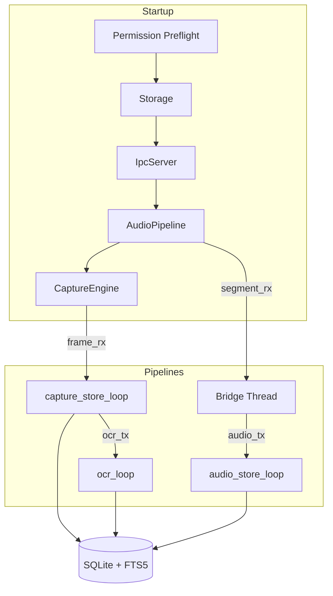

# Developer Guide — Chronicle Daemon

**Last updated:** 2026-08-22
**Component path:** chronicle-daemon/

## Overview

The daemon is Chronicle's background process. It captures screens, records
audio, runs OCR, and stores everything in SQLite with full-text search. It runs
headless, independent of the UI. The UI communicates with it over a
Unix socket. The current IPC surface is status-only.

The daemon is a Cargo workspace with six crates, each owning one concern. The
root binary (`chronicle-daemon`) orchestrates startup, wires crates into
pipelines, and handles shutdown.

## Architecture


```mermaid
flowchart TD
    subgraph Startup
        P[Permission Preflight] --> S[Storage]
        S --> IPC[IpcServer]
        IPC --> AP[AudioPipeline]
        AP --> CE[CaptureEngine]
    end

    subgraph Pipelines
        CE -->|frame_rx| CSL[capture_store_loop]
        CSL -->|ocr_tx| OCR[ocr_loop]
        AP -->|segment_rx| BT[Bridge Thread]
        BT -->|audio_tx| ASL[audio_store_loop]
    end

    CSL --> DB[(SQLite + FTS5)]
    OCR --> DB
    ASL --> DB
```

**Key files:**

| File | Role |
|------|------|
| `src/main.rs` | Entry point, startup sequence, shutdown |
| `src/permissions.rs` | macOS TCC permission checks (Screen Recording, Microphone) |
| `src/pipeline.rs` | Async tasks: capture-to-store, OCR, audio-to-store, bridge thread |

### Startup Sequence

1. `env_logger::Builder::from_env(...)` — logging, defaulting to
   `warn,chronicle=info` when `RUST_LOG` is unset
2. `permissions::preflight()` — checks Screen Recording (hard gate) and
   Microphone (informational). Exits with an actionable error if Screen
   Recording is denied.
3. `Storage::open()` — opens/migrates SQLite database
4. `IpcServer::start()` — starts the Unix-socket status server
5. `AudioPipeline::create()` — prepares the audio handler, dispatch queue, and
   encoding thread used by ScreenCaptureKit audio callbacks, and builds the
   microphone tap (installed eagerly; capture starts only on mic-on)
6. `CaptureEngine::start()` — enumerates displays, starts one SCStream per
   display, registers the audio handler on the primary display, and returns a
   frame receiver channel
7. Spawn `capture_store_loop` (Task A) and `ocr_loop` (Task B)
8. Spawn bridge thread and `audio_store_loop` (Task C)
9. Block on the shutdown signal (`SIGINT` from Ctrl-C or `SIGTERM`)

### Channel Topology

```text
CaptureEngine → [frame_rx: mpsc] → Task A (capture_store_loop)
                                        ↓ encode HEIF, insert DB
                                        ↓ try_send (lossy, best-effort)
                                   [ocr_tx: tokio::mpsc(1024)] → Task B (ocr_loop)
                                                                      ↓ Vision OCR
                                                                      ↓ update DB

AudioPipeline → [segment_rx: std::sync::mpsc] → Bridge Thread
                                                     ↓ blocking_send (lossless)
                                               [audio_tx: tokio::mpsc(64)] → Task C (audio_store_loop)
                                                                                 ↓ move file, insert DB
```

Capture-to-OCR is lossy (`try_send`) because OCR is slow and screenshots are
supplementary. Audio is lossless (`blocking_send`) because dropping a 30-second
segment means data loss.

### Shutdown

Triggered by `SIGINT` (Ctrl-C) or `SIGTERM`. Either signal enters the same
ordered teardown that cascades through the system:

1. `engine.stop()` + `drop(engine)` — stops SCStreams, closes `frame_rx`
2. `audio_pipeline.stop()` — drops the audio handler and flushes the encoding thread
3. `bridge_handle.join()` — bridge thread drains and exits, closing `audio_tx`
4. `await` all async tasks — they exit when their input channels close

No forced cancellation. Everything drains naturally.

## Key Concepts

**Two-process architecture:** The daemon and UI are separate
processes. If the UI crashes, capture continues. Persistent install at login
is deferred to packaging work (see HEU-448).

**Async OCR (and future transcription):** Capture and storage are the
critical path. OCR already runs behind the main ingestion loop, and any future
transcription work should follow the same pattern.

**Permission preflight:** Screen Recording is required for all ScreenCaptureKit
functionality (both screen capture and audio). Microphone is optional — mic
capture is off by default and toggled from the UI.

## Diagnosing a Microphone

Start here when a microphone records silence, near-silence, or empty
transcripts. The daemon logs the device's native input format once, when it
installs the tap:

```text
[2026-08-22T22:02:06Z INFO  chronicle_audio::microphone] microphone tap installed (capture starts on mic-on): 2 ch, 48000 Hz, interleaved=false, format=f32, mix_eligibility=stereo
```

It reports channel count, sample rate, whether samples are interleaved, the
sample format, and whether the device is eligible for the explicit downmix.

You will see it in a normal run — the daemon defaults to `warn,chronicle=info`,
so no `RUST_LOG` is needed:

```bash
cd chronicle-daemon
cargo run --bin chronicle-daemon
```

The command does not exit on its own — the shell waits on `cargo`, so Ctrl-C
once you have the line.

Watch for one of two lines, not just the first. When `MicrophoneCapture::new`
fails there is no tap install at all — `engine.rs` logs
`microphone capture unavailable: {e}` instead. Waiting only for `tap installed`
in that case looks identical to "the log is missing" while the actual
explanation scrolls past.

If you do set `RUST_LOG`, it replaces the default filter wholesale rather than
adding to it, and that catches people out. `RUST_LOG=chronicle_audio=debug` is
**not** additive: `env_filter` returns false for any target no directive
matches, whatever its level, so a lone crate directive silences every *other*
crate — `chronicle_daemon`'s own failures included. Lead with a level for
everything else, as in `RUST_LOG=warn,chronicle_audio=debug`.

Four things to know before you trust what you read:

- **A second daemon on the same data directory will not start.** `IpcServer`
  finds the existing socket and connects to it, and the newcomer exits with
  "another daemon is already listening" *before* it reaches the tap install — so
  you get no line at all, not an error about the microphone. Stop the running
  daemon first. (The check is socket-based, not a global lock: a different data
  directory has its own socket and its own daemon.)
- **Restart between devices.** `MicrophoneCapture` and its converter are built
  once when the pipeline is created, so changing the default input while the
  daemon runs leaves the converter built for the previous device.
- **The line does not name the device.** Nothing in it identifies which
  microphone it describes, and two different devices can produce byte-identical
  output. Confirm the default input in Audio MIDI Setup *before* you read the
  line, and label it yourself when you record it — otherwise a second
  measurement is indistinguishable from the first one repeated.
- **The line appears with the mic off.** The tap is installed eagerly at
  startup; capture begins only when the mic is enabled. Seeing this line is not
  evidence the microphone was live.

Cross-check the numbers against **Audio MIDI Setup** (`open -a "Audio MIDI
Setup"`), which shows each device's format. System Settings → Sound → Input only
tells you which device is selected.

`mix_eligibility` names which of three routes a future explicit downmix will
send the device down: `stereo` takes the measured mix, `mono` takes a fast
passthrough that skips the mixing machinery entirely, and `ineligible` — non-f32
input, zero channels, or more than two channels — stays on today's converter,
unchanged and unmeasured.

Because `ineligible` collapses those causes into one word, **read `format=` and
the channel count to find out which one applies** — that is what separates an
Int16 stereo microphone from a four-channel f32 array.

It is not a claim about the current audio path: as of HEU-649,
`AVAudioConverter` performs every downmix, for every device. HEU-652 is what
changes that, and this paragraph with it.

### Recording what the tap receives

When the format line is not enough, record the audio itself. The
`characterize` feature on `chronicle-audio` adds an example that captures the
tap's native channels and the converter's mono output as WAV files, plus a
manifest. It is compiled out of every default build, so it never ships.

```bash
cd chronicle-daemon
cargo run -p chronicle-audio --features characterize --example characterize_mic -- \
  --device-label "Blue Yeti" --mode stereo --gain 50% \
  --phrase "the quick brown fox jumps over the lazy dog" --model-variant base \
  --seconds 10 --out ~/chronicle-captures/yeti-take-1
```

`--device-label` is only a label. Set the default input device in System
Settings first and check it in Audio MIDI Setup; the example records whatever
is active. `--out` must be a new or empty directory, one per take. Keep it
outside the repository: a take is a recording of your voice. The names the
example and the analyzer write are gitignored as a backstop, but the directory
itself is not, so a take left inside the tree still shows up in `git status`.
Read the
same phrase, the same way, on every take; the manifest records it. The first
run prompts for microphone permission. Exit code 2 means the recording is not
a valid measurement: a dropped frame, a conversion failure, a frame the tap
could not read, a channel that closed early, or no frames at all. The manifest
has a line for each; re-record rather than reason about the hole. A good take
leaves three files in `--out`: `mic-native.wav`, `mic-converted.wav` and
`manifest.txt`.

Then analyse it offline. The script needs `uv` (`brew install uv`); its numpy
and scipy are locked next to it.

```bash
uv run scripts/analyze_mic_capture.py ~/chronicle-captures/yeti-take-1
```

It reads the manifest and refuses a recording marked invalid (pass
`--allow-invalid` to look anyway), prints per-channel levels, correlation, and
the four candidate mixes, writes `analysis.json`, and writes one 16 kHz WAV per
candidate. Exit code 3 means a precedence gate fired: mono input, a non-f32
file, every channel silent, a level that is not finite, or every channel flat
with zero variance. The report's `STOP:` line names which, `analysis.json`
records it, and no candidate is written. A
mono microphone always stops at gate 0; that is the script working, not a
fault. A device with more than two channels passes the gates, exits 0 with
per-channel levels only, and writes no candidates: the four mixes are defined
for two channels. Transcribe a candidate through the real engine with:

```bash
cargo run -p chronicle-transcription --example transcribe_wav -- ~/chronicle-captures/yeti-take-1/candidate-avg.wav --variant base
```

It needs the `base` model under the Chronicle data directory; if it is missing,
run `scripts/fetch-whisper-model.sh base` from `chronicle-daemon/`. The analysis
never normalizes or trims. Read the HEU-549 design and HEU-651
before drawing a conclusion from the numbers; correlation is evidence, not the
decision rule.

The audio callback does none of this work. It copies samples and sends one
message; a separate thread writes the files. That split is ADR-013.

## How to Modify

### Adding a new pipeline stage

1. Define a channel in `main.rs` (decide bounded size and lossy vs lossless)
2. Write the async loop function in `pipeline.rs` following the existing pattern
3. Spawn it with `tokio::spawn` in `main.rs`
4. Add shutdown handling (tasks exit when their input channel closes)

### Adding a new permission check

1. Add a status enum and FFI call in `permissions.rs`
2. Call it from `preflight()` — decide hard gate vs informational
3. Log the status at the appropriate level (info for ok, error for denied)

### Adding a new crate to the workspace

1. Create the crate under `crates/`
2. Add it to `chronicle-daemon/Cargo.toml` workspace members and dependencies
3. Wire it into `main.rs` and/or `pipeline.rs`

## Dependencies

### Workspace Crates

| Crate | Purpose | Key External Deps |
|-------|---------|-------------------|
| `chronicle-capture` | Screen capture via ScreenCaptureKit | `screencapturekit`, `objc2-app-kit`, `core-graphics` |
| `chronicle-audio` | Audio capture + Opus encoding | `objc2-screen-capture-kit`, `opus`, `ogg` |
| `chronicle-storage` | SQLite + FTS5 storage engine | `rusqlite` (bundled), `r2d2` |
| `chronicle-ocr` | Text extraction via Vision framework | `objc2-vision` |
| `chronicle-transcription` | Placeholder for future speech-to-text work | none today |
| `chronicle-ipc` | JSON over Unix socket status server | `serde`, `serde_json` |

All crates are independent of each other. The daemon binary depends on every
crate above except `chronicle-transcription`, which is currently an unused
workspace member kept as a placeholder for future speech-to-text work.

### What depends on the daemon

The Swift UI (`chronicle-ui`) communicates with the daemon over a Unix socket.
It does not depend on the daemon as a library — only on the IPC protocol.

## Building

```bash
cd chronicle-daemon
cargo build            # debug
cargo build --release  # release
```

The repo-root `.cargo/config.toml` carries two things the binary needs:

- the `/usr/lib/swift` rpath, without which any binary touching
  ScreenCaptureKit crashes at launch with "no LC_RPATH's found"
- `CMAKE_POLICY_VERSION_MINIMUM=3.5`, without which the vendored Opus build in
  `audiopus_sys` fails to configure under CMake 4

Cargo finds that file by walking up from the directory it is invoked in, so it
applies from the repo root, `chronicle-daemon/`, and anywhere below. Building
from the root with `--manifest-path chronicle-daemon/Cargo.toml` works too.

## Testing

### Unit tests

```bash
cd chronicle-daemon && cargo test --workspace
```

All crates have unit tests. No special setup needed for this command. The SOP
`test_command` runs two more stages after it: `cargo test -p chronicle-audio
--features characterize` for the feature-gated audio tests, and
`uv run scripts/test_analyze_mic_capture.py` for the Python analyzer. Those
need the `characterize` feature to build and `uv` installed. The Swift tests
run last.

### Integration tests

Capture and audio integration tests require real macOS permissions and are
marked `#[ignore]`. Run them with:

```bash
cd chronicle-daemon && cargo test --workspace -- --ignored
```

Grant Screen Recording and Microphone permissions to your terminal app first.

### Linting

```bash
cd chronicle-daemon && cargo clippy --workspace --all-targets -- -D warnings && cargo check -p chronicle-audio --features characterize --all-targets
```

The SOP gate runs workspace clippy with `--all-targets -- -D warnings`, then
`cargo check -p chronicle-audio --features characterize --all-targets`. The
second command builds the feature-gated code and its example without running
anything, so the lint gate catches a broken example on its own. The
feature-gated tests run with `cargo test -p chronicle-audio --features
characterize`, and the Python analyzer's tests with
`uv run scripts/test_analyze_mic_capture.py`, both as part of `test_command`.
