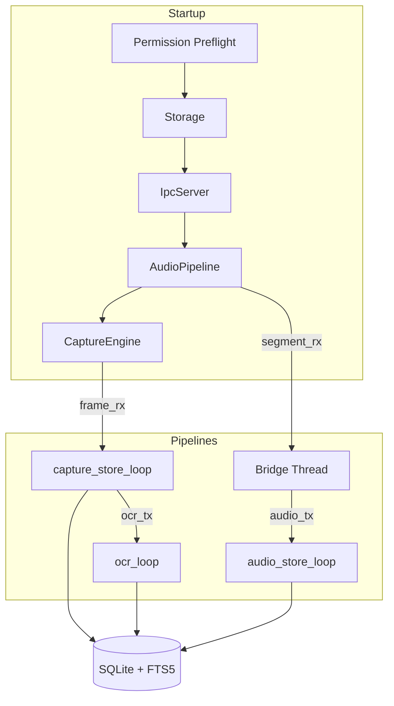

# Developer Guide — Chronicle Daemon

**Last updated:** 2026-08-22
**Component path:** chronicle-daemon/

## Overview

The daemon is Chronicle's background process. It captures screens, records
audio, runs OCR, and stores everything in SQLite with full-text search. It runs
headless, independent of the UI. The UI communicates with it over a
Unix socket. The current IPC surface is status-only.

The daemon is a Cargo workspace with six crates, each owning one concern. The
root binary (`chronicle-daemon`) orchestrates startup, wires crates into
pipelines, and handles shutdown.

## Architecture


```mermaid
flowchart TD
    subgraph Startup
        P[Permission Preflight] --> S[Storage]
        S --> IPC[IpcServer]
        IPC --> AP[AudioPipeline]
        AP --> CE[CaptureEngine]
    end

    subgraph Pipelines
        CE -->|frame_rx| CSL[capture_store_loop]
        CSL -->|ocr_tx| OCR[ocr_loop]
        AP -->|segment_rx| BT[Bridge Thread]
        BT -->|audio_tx| ASL[audio_store_loop]
    end

    CSL --> DB[(SQLite + FTS5)]
    OCR --> DB
    ASL --> DB
```

**Key files:**

| File | Role |
|------|------|
| `src/main.rs` | Entry point, startup sequence, shutdown |
| `src/permissions.rs` | macOS TCC permission checks (Screen Recording, Microphone) |
| `src/pipeline.rs` | Async tasks: capture-to-store, OCR, audio-to-store, bridge thread |

### Startup Sequence

1. `env_logger::Builder::from_env(...)` — logging, defaulting to
   `warn,chronicle=info` when `RUST_LOG` is unset
2. `permissions::preflight()` — checks Screen Recording (hard gate) and
   Microphone (informational). Exits with an actionable error if Screen
   Recording is denied.
3. `Storage::open()` — opens/migrates SQLite database
4. `IpcServer::start()` — starts the Unix-socket status server
5. `AudioPipeline::create()` — prepares the audio handler, dispatch queue, and
   encoding thread used by ScreenCaptureKit audio callbacks, and builds the
   microphone tap (installed eagerly; capture starts only on mic-on)
6. `CaptureEngine::start()` — enumerates displays, starts one SCStream per
   display, registers the audio handler on the primary display, and returns a
   frame receiver channel
7. Spawn `capture_store_loop` (Task A) and `ocr_loop` (Task B)
8. Spawn bridge thread and `audio_store_loop` (Task C)
9. Block on the shutdown signal (`SIGINT` from Ctrl-C or `SIGTERM`)

### Channel Topology

```text
CaptureEngine → [frame_rx: mpsc] → Task A (capture_store_loop)
                                        ↓ encode HEIF, insert DB
                                        ↓ try_send (lossy, best-effort)
                                   [ocr_tx: tokio::mpsc(1024)] → Task B (ocr_loop)
                                                                      ↓ Vision OCR
                                                                      ↓ update DB

AudioPipeline → [segment_rx: std::sync::mpsc] → Bridge Thread
                                                     ↓ blocking_send (lossless)
                                               [audio_tx: tokio::mpsc(64)] → Task C (audio_store_loop)
                                                                                 ↓ move file, insert DB
```

Capture-to-OCR is lossy (`try_send`) because OCR is slow and screenshots are
supplementary. Audio is lossless (`blocking_send`) because dropping a 30-second
segment means data loss.

### Shutdown

Triggered by `SIGINT` (Ctrl-C) or `SIGTERM`. Either signal enters the same
ordered teardown that cascades through the system:

1. `engine.stop()` + `drop(engine)` — stops SCStreams, closes `frame_rx`
2. `audio_pipeline.stop()` — drops the audio handler and flushes the encoding thread
3. `bridge_handle.join()` — bridge thread drains and exits, closing `audio_tx`
4. `await` all async tasks — they exit when their input channels close

No forced cancellation. Everything drains naturally.

## Key Concepts

**Two-process architecture:** The daemon and UI are separate
processes. If the UI crashes, capture continues. Persistent install at login
is deferred to packaging work (see HEU-448).

**Async OCR (and future transcription):** Capture and storage are the
critical path. OCR already runs behind the main ingestion loop, and any future
transcription work should follow the same pattern.

**Permission preflight:** Screen Recording is required for all ScreenCaptureKit
functionality (both screen capture and audio). Microphone is optional — mic
capture is off by default and toggled from the UI.

## Diagnosing a Microphone

Start here when a microphone records silence, near-silence, or empty
transcripts. The daemon logs the device's identity and native input format
once, when it installs the tap:

```text
[2026-08-22T22:02:06Z INFO  chronicle_audio::microphone] microphone tap installed (capture starts on mic-on): device_name="Yeti Stereo Microphone" device_uid="AppleUSBAudioEngine:Generic:Blue Microphones:<serial>:1", 2 ch, 48000 Hz, interleaved=false, format=f32
```

It reports the input device you selected — its name and CoreAudio UID — then
channel count, sample rate, whether samples are interleaved, and the sample
format.

**The two halves can describe different CoreAudio objects.** The device fields
name the input device you selected in System Settings. The format numbers come
from whatever `AVAudioEngine` bound, which is usually a private aggregate
wrapping the default route rather than the device itself.

For a plain microphone these agree. **For an aggregate you built in Audio MIDI
Setup they will not**, and that is expected rather than a symptom: CoreAudio
flattens your aggregate into its own, so the numbers come from one member while
the name is the aggregate. A channel count that disagrees with what Audio MIDI
Setup shows for the named device is this, not a fault.

**Redact the UID before you paste this line anywhere public.** A real
`AppleUSBAudioEngine:` UID carries the device's hardware serial in its
**second-to-last** segment — the trailing one is an interface index, not a
secret. Replace the serial with `<serial>` and say you did; a comparison still
holds with both sides redacted. `mheuss/chronicle` is a public repository.

**A `2 ch` mic is the usual reason audio comes back quiet.** The converter is
built with no `channelMap`, so a 2-to-1 conversion selects channel 0 and
discards channel 1 — it does not mix them. If the device puts most of its level
on channel 1, that level never reaches the recording. HEU-651 measured this on a
Blue Yeti: its channel 0 runs 7.7-7.9 dB below its channel 1, and the converter
output was bit-identical to channel 0. A mic that duplicates its channels, like
the EMEET SmartCam, is unaffected.

Both measured devices reported `interleaved=false, format=f32`, and that is the
layout the regression test pins. A stereo device reporting some other layout was
not measured, so read those two fields in the line above before assuming this is
your problem. Quiet audio from a `1 ch` device is a different problem, and this
is not it.

You will see the line in a normal run — the daemon defaults to
`warn,chronicle=info`, so no `RUST_LOG` is needed:

```bash
cd chronicle-daemon
cargo run --bin chronicle-daemon
```

The command does not exit on its own — the shell waits on `cargo`, so Ctrl-C
once you have the line.

Watch for one of two lines, not just the first. When `MicrophoneCapture::new`
fails there is no tap install at all — `engine.rs` logs
`microphone capture unavailable: {e}` instead. Waiting only for `tap installed`
in that case looks identical to "the log is missing" while the actual
explanation scrolls past.

If you do set `RUST_LOG`, it replaces the default filter wholesale rather than
adding to it, and that catches people out. `RUST_LOG=chronicle_audio=debug` is
**not** additive: `env_filter` returns false for any target no directive
matches, whatever its level, so a lone crate directive silences every *other*
crate — `chronicle_daemon`'s own failures included. Lead with a level for
everything else, as in `RUST_LOG=warn,chronicle_audio=debug`.

Three things to know before you trust what you read:

- **A second daemon on the same data directory will not start.** `IpcServer`
  finds the existing socket and connects to it, and the newcomer exits with
  "another daemon is already listening" *before* it reaches the tap install — so
  you get no line at all, not an error about the microphone. Stop the running
  daemon first. (The check is socket-based, not a global lock: a different data
  directory has its own socket and its own daemon.)
- **Restart between devices.** `MicrophoneCapture` and its converter are built
  once when the pipeline is created, so changing the default input while the
  daemon runs leaves the converter built for the previous device.
- **The line appears with the mic off.** The tap is installed eagerly at
  startup; capture begins only when the mic is enabled. Seeing this line is not
  evidence the microphone was live.

Cross-check the numbers against **Audio MIDI Setup** (`open -a "Audio MIDI
Setup"`), which shows each device's format. System Settings → Sound → Input only
tells you which device is selected.

## How to Modify

### Adding a new pipeline stage

1. Define a channel in `main.rs` (decide bounded size and lossy vs lossless)
2. Write the async loop function in `pipeline.rs` following the existing pattern
3. Spawn it with `tokio::spawn` in `main.rs`
4. Add shutdown handling (tasks exit when their input channel closes)

### Adding a new permission check

1. Add a status enum and FFI call in `permissions.rs`
2. Call it from `preflight()` — decide hard gate vs informational
3. Log the status at the appropriate level (info for ok, error for denied)

### Adding a new crate to the workspace

1. Create the crate under `crates/`
2. Add it to `chronicle-daemon/Cargo.toml` workspace members and dependencies
3. Wire it into `main.rs` and/or `pipeline.rs`

## Dependencies

### Workspace Crates

| Crate | Purpose | Key External Deps |
|-------|---------|-------------------|
| `chronicle-capture` | Screen capture via ScreenCaptureKit | `objc2-screen-capture-kit`, `objc2-app-kit`, `core-graphics` |
| `chronicle-audio` | Audio capture + Opus encoding | `objc2-avf-audio`, `objc2-audio-toolbox`, `objc2-core-audio`, `objc2-screen-capture-kit`, `opus`, `ogg` |
| `chronicle-storage` | SQLite + FTS5 storage engine | `rusqlite` (bundled), `r2d2` |
| `chronicle-ocr` | Text extraction via Vision framework | `objc2-vision` |
| `chronicle-transcription` | Local speech-to-text via whisper.cpp | `whisper-rs`, `opus`, `ogg`, `sha1` |
| `chronicle-ipc` | JSON over Unix socket status server | `serde`, `serde_json` |

The daemon binary depends on every crate above, `chronicle-transcription`
included: `provisioning.rs` loads and calls it, and `transcription-metal` is a
default feature. At runtime the crates are independent of each other with one
exception — `chronicle-capture` depends on `chronicle-audio`. There is a second
edge in test builds only: `chronicle-transcription` takes `chronicle-audio` as a
dev-dependency for `OggOpusEncoder`, so `cargo test -p chronicle-transcription`
builds it.

### What depends on the daemon

The Swift UI (`chronicle-ui`) communicates with the daemon over a Unix socket.
It does not depend on the daemon as a library — only on the IPC protocol.

## Building

```bash
cd chronicle-daemon
cargo build            # debug
cargo build --release  # release
```

The repo-root `.cargo/config.toml` carries two things the binary needs:

- the `/usr/lib/swift` rpath, without which any binary touching
  ScreenCaptureKit crashes at launch with "no LC_RPATH's found"
- `CMAKE_POLICY_VERSION_MINIMUM=3.5`, without which the vendored Opus build in
  `audiopus_sys` fails to configure under CMake 4

Cargo finds that file by walking up from the directory it is invoked in, so it
applies from the repo root, `chronicle-daemon/`, and anywhere below. Building
from the root with `--manifest-path chronicle-daemon/Cargo.toml` works too.

## Testing

### Unit tests

```bash
cd chronicle-daemon && cargo test --workspace
```

All crates have unit tests. No special setup needed for this command. The SOP
`test_command` runs the Swift tests after it.

### Integration tests

Capture and audio integration tests require real macOS permissions and are
marked `#[ignore]`. Run them with:

```bash
cd chronicle-daemon && cargo test --workspace -- --ignored
```

Grant Screen Recording and Microphone permissions to your terminal app first.

### Linting

```bash
cd chronicle-daemon && cargo clippy --workspace --all-targets -- -D warnings
```

The SOP gate runs workspace clippy with `--all-targets -- -D warnings`.
